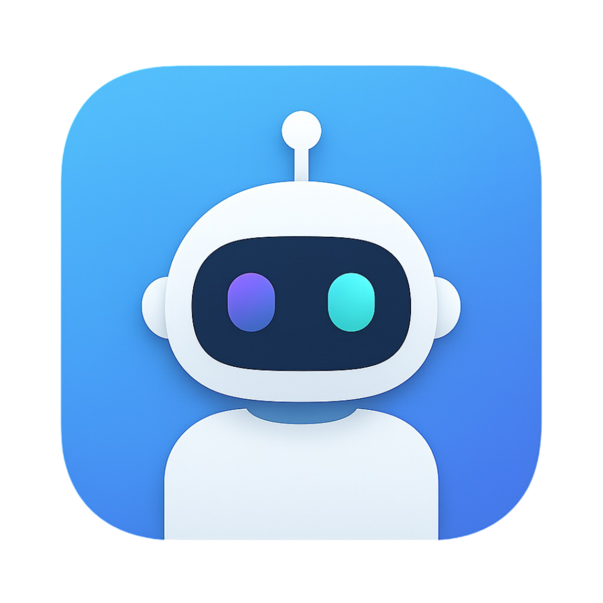
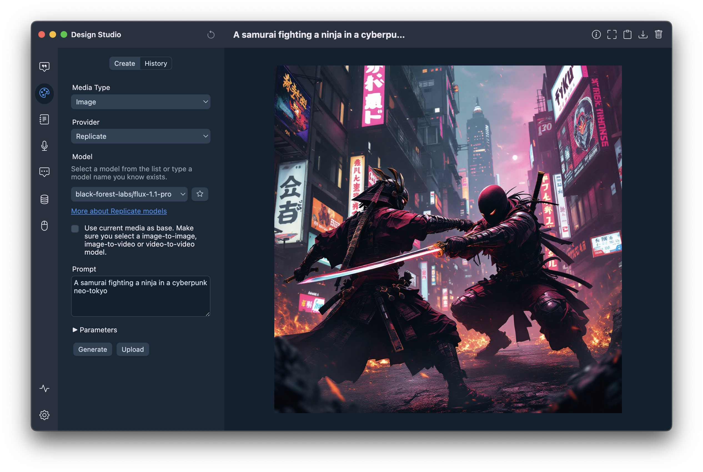
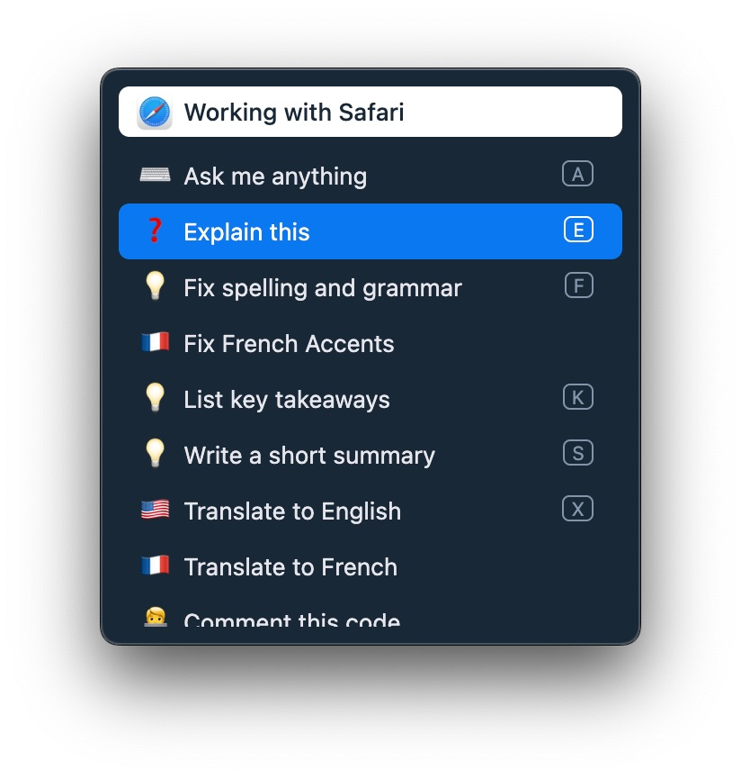
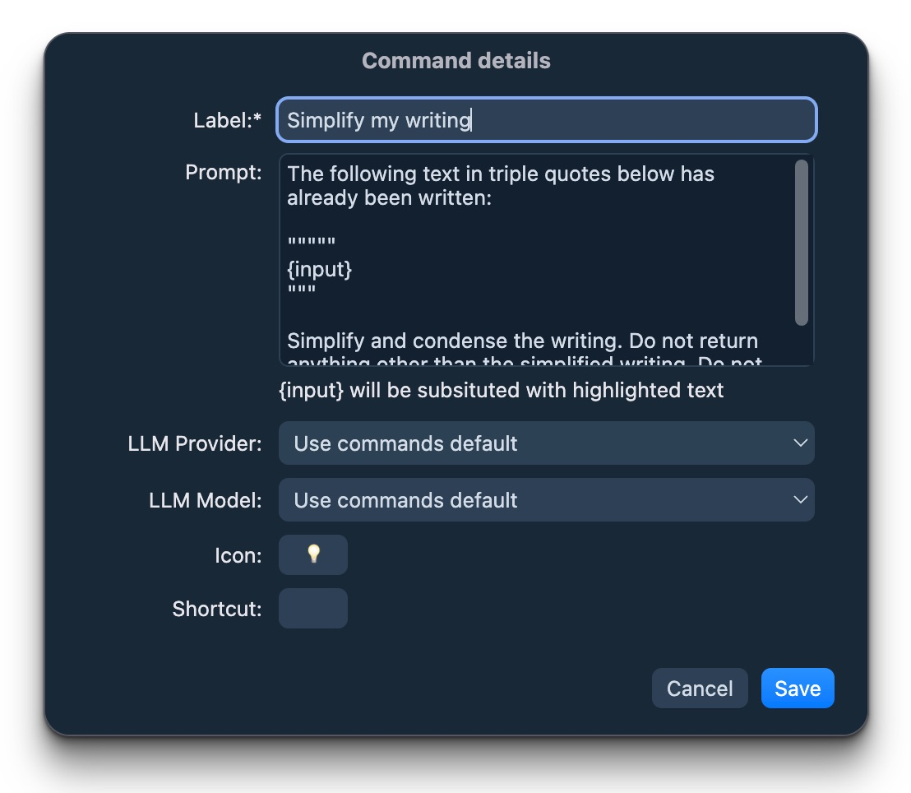
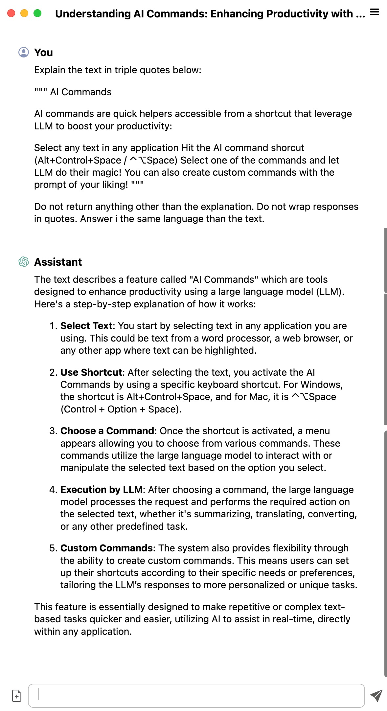

<div align="center">

  
  <div><b>Witsy</b></div>
  <div>Desktop AI Assistant<br/>Universal MCP Client</div>

</div>

<p></p>
<div align="center">

[](https://github.com/nbonamy/witsy/releases)
[](https://tooomm.github.io/github-release-stats/?username=nbonamy&repository=witsy)
[](https://github.com/nbonamy/witsy/blob/main/.github/workflows/test.yml)
[](https://github.com/nbonamy/witsy/blob/main/.github/workflows/test.yml)

</div>

<div align="center">

[](https://github.com/sponsors/nbonamy)
[](https://deepwiki.com/nbonamy/witsy)

</div>

## Downloads

Download Witsy from the [releases](https://github.com/nbonamy/witsy/releases) page.

On macOS you can also `brew install --cask witsy`.


## What is Witsy?

Witsy is a BYOK (Bring Your Own Keys) AI application: it means you need to have API keys for the LLM providers you want to use. Alternatively,
you can use [Ollama](https://ollama.com) to run models locally on your machine for free and use them in Witsy.

It is the first of very few (only?) universal MCP clients:<br/>***Witsy allows you to run MCP servers with virtually any LLM!***

## Supported AI Providers

| Capability | Providers |
|------------|-----------|
| **Chat** | OpenAI, Anthropic, Google (Gemini), xAI (Grok), Meta (Llama), Ollama, LM Studio, MistralAI, DeepSeek, OpenRouter, Groq, Cerebras, Azure OpenAI, any provider who supports the OpenAI API standard (together.ai for instance)|
| **Image Creation** | OpenAI, Google, xAI, Replicate, fal.ai, HuggingFace, Stable Diffusion WebUI |
| **Video Creation** | OpenAI, Google, Replicate, fal.ai |
| **Text-to-Speech** | OpenAI, ElevenLabs, Groq, fal.ai |
| **Speech-to-Text** | OpenAI (Whisper), fal.ai, Fireworks.ai, Gladia, Groq, nVidia, Speechmatics, Local Whisper, Soniox (realtime and async)  any provider who supports the OpenAI API standard |
| **Search Engines** | Perplexity, Tavily, Brave, Exa, Local Google Search |
| **MCP Repositories** | Smithery.ai
| **Embeddings** | OpenAI, Ollama |

Non-exhaustive feature list:
- Chat completion with vision models support (describe an image)
- Text-to-image and text-to video
- Image-to-image (image editing) and image-to-video
- LLM plugins to augment LLM: execute python code, search the Internet...
- Anthropic MCP server support
- Scratchpad to interactively create the best content with any model!
- Prompt anywhere allows to generate content directly in any application
- AI commands runnable on highlighted text in almost any application
- Experts prompts to specialize your bot on a specific topic
- Long-term memory plugin to increase relevance of LLM answers
- Read aloud of assistant messages
- Read aloud of any text in other applications
- Chat with your local files and documents (RAG)
- Transcription/Dictation (Speech-to-Text)
- Realtime Chat aka Voice Mode
- Anthropic Computer Use support
- Local history of conversations (with automatic titles)
- Formatting and copy to clipboard of generated code
- Conversation PDF export
- Image copy and download

<p align="center">
  &nbsp;&nbsp;
  &nbsp;&nbsp;
  
</p>

## Setup

You can download a binary from from the [releases](https://github.com/nbonamy/witsy/releases) page or build yourself:

```
npm ci
npm start
```

## Prerequisites

To use OpenAI, Anthropic, Google or Mistral AI models, you need to enter your API key:
- [OpenAI](https://platform.openai.com/api-keys)
- [Anthropic](https://console.anthropic.com/settings/keys)
- [Google](https://aistudio.google.com/app/apikey)
- [xAI](https://console.x.ai/team/)
- [Meta](https://llama.developer.meta.com/api-keys/)
- [MistralAI](https://console.mistral.ai/api-keys/)
- [DeepSeek](https://platform.deepseek.com/api_keys)
- [OpenRouter](https://openrouter.ai/settings/keys)
- [Groq](https://console.groq.com/keys)
- [Cerebras](https://cloud.cerebras.ai/platform/)

To use Ollama models, you need to install [Ollama](https://ollama.com) and download some [models](https://ollama.com/search).

To use text-to-speech, you need an 
- [OpenAI API key](https://platform.openai.com/api-keys).
- [Fal.ai API Key](https://fal.ai/dashboard/keys)
- [Fireworks.ai API Key](https://app.fireworks.ai/settings/users/api-keys)
- [Groq API Key](https://console.groq.com/keys)
- [Speechmatics API Key](https://portal.speechmatics.com/settings/api-keys)
- [Gladia API Key](https://app.gladia.io/account) 
  
To use Internet search you need a [Tavily API key](https://app.tavily.com/home).

<p align="center">
  &nbsp;&nbsp;
</p>

## Prompt Anywhere

Generate content in any application:
- From any editable content in any application
- Hit the Prompt anywhere shortcut (Shift+Control+Space / ^⇧Space)
- Enter your prompt in the window that pops up
- Watch Witsy enter the text directly in your application!

On Mac, you can define an expert that will automatically be triggered depending on the foreground application. For instance, if you have an expert used to generate linux commands, you can have it selected if you trigger Prompt Anywhere from the Terminal application!

## AI Commands

AI commands are quick helpers accessible from a shortcut that leverage LLM to boost your productivity:
- Select any text in any application
- Hit the AI command shorcut (Alt+Control+Space / ⌃⌥Space)
- Select one of the commands and let LLM do their magic!

You can also create custom commands with the prompt of your liking!

<p align="center">
  &nbsp;&nbsp;
  &nbsp;&nbsp;
  
</p>

Commands inspired by [https://the.fibery.io/@public/Public_Roadmap/Roadmap_Item/AI-Assistant-via-ChatGPT-API-170](https://the.fibery.io/@public/Public_Roadmap/Roadmap_Item/AI-Assistant-via-ChatGPT-API-170).

## Experts

From [https://github.com/f/awesome-chatgpt-prompts](https://github.com/f/awesome-chatgpt-prompts).

## Scratchpad

https://www.youtube.com/watch?v=czcSbG2H-wg

## Chat with your documents (RAG)

You can connect each chat with a document repository: Witsy will first search for relevant documents in your local files and provide this info to the LLM. To do so:

- Click on the database icon on the left of the prompt
- Click Manage and then create a document repository
- OpenAI Embedding require on API key, Ollama requires an embedding model
- Add documents by clicking the + button on the right hand side of the window
- Once your document repository is created, click on the database icon once more and select the document repository you want to use. The icon should turn blue

## Transcription / Dictation (Speech-to-Text)

You can transcribe audio recorded on the microphone to text. Transcription can be done using a variety of state of the art speech to text models (which require API key) or using local Whisper model (requires download of large files).

Currently Witsy supports the following speech to text models:
- GPT4o-Transcribe
- Gladia
- Speechmatics (Standards + Enhanced)
- Groq Whisper V3
- Fireworks.ai Realtime Transcription
- fal.ai Wizper V3
- fal.ai ElevenLabs
- nVidia Microsoft Phi-4 Multimodal 

Witsy supports quick shortcuts, so your transcript is always only one button press away. 

Once the text is transcribed you can:

- Copy it to your clipboard
- Summarize it
- Translate it to any language
- Insert it in the application that was running before you activated the dictation

## Anthropic Computer Use

https://www.youtube.com/watch?v=vixl7I07hBk

## HTTP API

Witsy provides a local HTTP API that allows external applications to trigger various commands and features. The API server runs on `localhost` by default on port **8090** (or the next available port if 8090 is in use).

**Security Note:**
The HTTP server runs on localhost only by default. If you need external access, consider using a reverse proxy with proper authentication.

### Finding the Server Port

The current HTTP server port is displayed in the tray menu below the Settings option:
- **macOS/Linux**: Check the fountain pen icon in the menu bar
- **Windows**: Check the fountain pen icon in the system tray

### Available Endpoints

All endpoints support both `GET` (with query parameters) and `POST` (with JSON or form-encoded body) requests.

| Endpoint | Description | Optional Parameters |
|----------|-------------|---------------------|
| `GET /api/health` | Server health check | - |
| `GET/POST /api/chat` | Open main window in chat view | `text` - Pre-fill chat input |
| `GET/POST /api/scratchpad` | Open scratchpad | - |
| `GET/POST /api/settings` | Open settings window | - |
| `GET/POST /api/studio` | Open design studio | - |
| `GET/POST /api/forge` | Open agent forge | - |
| `GET/POST /api/realtime` | Open realtime chat (voice mode) | - |
| `GET/POST /api/prompt` | Trigger Prompt Anywhere | `text` - Pre-fill prompt |
| `GET/POST /api/command` | Trigger AI command picker | `text` - Pre-fill command text |
| `GET/POST /api/transcribe` | Start transcription/dictation | - |
| `GET/POST /api/readaloud` | Start read aloud | - |
| `GET /api/engines` | List available AI engines | Returns configured chat engines |
| `GET /api/models/:engine` | List models for an engine | Returns available models for specified engine |
| `POST /api/complete` | Run chat completion | `stream` (default: true), `engine`, `model`, `thread` (Message[]) |
| `GET/POST /api/agent/run/:token` | Trigger agent execution via webhook | Query params passed as prompt inputs |
| `GET /api/agent/status/:token/:runId` | Check agent execution status | Returns status, output, and error |

### Example Usage

```bash
# Health check
curl http://localhost:8090/api/health

# Open chat with pre-filled text (GET with query parameter)
curl "http://localhost:8090/api/chat?text=Hello%20World"

# Open chat with pre-filled text (POST with JSON)
curl -X POST http://localhost:8090/api/chat \
  -H "Content-Type: application/json" \
  -d '{"text":"Hello World"}'

# Trigger Prompt Anywhere with text
curl "http://localhost:8090/api/prompt?text=Write%20a%20poem"

# Trigger AI command on selected text
curl -X POST http://localhost:8090/api/command \
  -H "Content-Type: application/json" \
  -d '{"text":"selected text to process"}'

# Trigger agent via webhook with parameters
curl "http://localhost:8090/api/agent/run/abc12345?input1=value1&input2=value2"

# Trigger agent with POST JSON
curl -X POST http://localhost:8090/api/agent/run/abc12345 \
  -H "Content-Type: application/json" \
  -d '{"input1":"value1","input2":"value2"}'

# Check agent execution status
curl "http://localhost:8090/api/agent/status/abc12345/run-uuid-here"

# List available engines
curl http://localhost:8090/api/engines

# List models for a specific engine
curl http://localhost:8090/api/models/openai

# Run non-streaming chat completion
curl -X POST http://localhost:8090/api/complete \
  -H "Content-Type: application/json" \
  -d '{
    "stream": "false",
    "engine": "openai",
    "model": "gpt-4",
    "thread": [
      {"role": "user", "content": "Hello, how are you?"}
    ]
  }'

# Run streaming chat completion (SSE)
curl -X POST http://localhost:8090/api/complete \
  -H "Content-Type: application/json" \
  -d '{
    "stream": "true",
    "thread": [
      {"role": "user", "content": "Write a short poem"}
    ]
  }'
```

### Command Line Interface

Witsy includes a command-line interface that allows you to interact with the AI assistant directly from your terminal.

**Installation**

The CLI is automatically installed when you launch Witsy for the first time:
- **macOS**: Creates a symlink at `/usr/local/bin/witsy` (requires admin password)
- **Windows**: Adds the CLI to your user PATH (restart terminal for changes to take effect)
- **Linux**: Creates a symlink at `/usr/local/bin/witsy` (uses pkexec if needed)

**Usage**

Once installed, you can use the `witsy` command from any terminal:

```bash
witsy
```

The CLI will connect to your running Witsy application and provide an interactive chat interface. It uses the same configuration (engine, model, API keys) as your desktop application.

**Available Commands**
- `/help` - Show available commands
- `/model` - Select engine and model
- `/port` - Change server port (default: 4321)
- `/clear` - Clear conversation history
- `/history` - Show conversation history
- `/exit` - Exit the CLI

**Requirements**
- Witsy desktop application must be running
- HTTP API server enabled (default port: 4321)

### CLI Chat Completion API

The `/api/complete` endpoint provides programmatic access to Witsy's chat completion functionality, enabling command-line tools and scripts to interact with any configured LLM.

**Endpoint**: `POST /api/complete`

**Request body**:
```json
{
  "stream": "true",       // Optional: "true" (default) for SSE streaming, "false" for JSON response
  "engine": "openai",     // Optional: defaults to configured engine in settings
  "model": "gpt-4",       // Optional: defaults to configured model for the engine
  "thread": [             // Required: array of messages
    {"role": "user", "content": "Your prompt here"}
  ]
}
```

**Response (non-streaming, `stream: "false"`):**
```json
{
  "success": true,
  "response": {
    "content": "The assistant's response text",
    "usage": {
      "promptTokens": 10,
      "completionTokens": 20,
      "totalTokens": 30
    }
  }
}
```

**Response (streaming, `stream: "true"`):**
Server-Sent Events (SSE) format with chunks:
```
data: {"type":"content","text":"Hello","done":false}
data: {"type":"content","text":" world","done":false}
data: [DONE]
```

**List Engines:**
```bash
curl http://localhost:8090/api/engines
```
Response:
```json
{
  "engines": [
    {"id": "openai", "name": "OpenAI"},
    {"id": "anthropic", "name": "Anthropic"},
    {"id": "google", "name": "Google"}
  ]
}
```

**List Models for an Engine:**
```bash
curl http://localhost:8090/api/models/openai
```
Response:
```json
{
  "engine": "openai",
  "models": [
    {"id": "gpt-4", "name": "GPT-4"},
    {"id": "gpt-3.5-turbo", "name": "GPT-3.5 Turbo"}
  ]
}
```

### Command Line Interface (CLI)

Witsy includes a command-line interface for interacting with AI models directly from your terminal.

**Requirements:**
- Witsy application must be running (for the HTTP API server)

**Launch the CLI:**
```bash
npm run cli
```

Enter `/help` to show the list of commands

---

### Agent Webhooks

Agent webhooks allow you to trigger agent execution via HTTP requests, enabling integration with external systems, automation tools, or custom workflows.

#### How It Works

**Setting up a webhook:**
1. Open the Agent Forge and select or create an agent
2. Navigate to the "Invocation" tab (last step in the wizard)
3. Check the "🌐 Webhook" checkbox
4. A unique 8-character token is automatically generated for your agent
5. Copy the webhook URL displayed (format: `http://localhost:{port}/api/agent/run/{token}`)
6. You can regenerate the token at any time using the refresh button

**Using the webhook:**
- Send GET or POST requests to the webhook URL
- Include parameters as query strings (GET) or JSON body (POST)
- Parameters are automatically passed to the agent's prompt as input variables
- The agent must have prompt variables defined (e.g., `{task}`, `{name}`) to receive the parameters
- The webhook returns immediately with a `runId` and `statusUrl` for checking execution status

**Example agent prompt:**
```
Please process the following task: {task}
User: {user}
Priority: {priority}
```

**Triggering the agent:**
```bash
# Using GET with query parameters
curl "http://localhost:8090/api/agent/run/abc12345?task=backup&user=john&priority=high"

# Using POST with JSON
curl -X POST http://localhost:8090/api/agent/run/abc12345 \
  -H "Content-Type: application/json" \
  -d '{"task":"backup","user":"john","priority":"high"}'
```

**Run response:**
```json
{
  "success": true,
  "runId": "550e8400-e29b-41d4-a716-446655440000",
  "statusUrl": "/api/agent/status/abc12345/550e8400-e29b-41d4-a716-446655440000"
}
```

**Checking execution status:**
```bash
# Use the statusUrl from the webhook response (relative path)
curl "http://localhost:8090/api/agent/status/abc12345/550e8400-e29b-41d4-a716-446655440000"
```

**Status response (running):**
```json
{
  "success": true,
  "runId": "550e8400-e29b-41d4-a716-446655440000",
  "agentId": "agent-uuid",
  "status": "running",
  "createdAt": 1234567890000,
  "updatedAt": 1234567900000,
  "trigger": "webhook"
}
```

**Status response (success):**
```json
{
  "success": true,
  "runId": "550e8400-e29b-41d4-a716-446655440000",
  "agentId": "agent-uuid",
  "status": "success",
  "createdAt": 1234567890000,
  "updatedAt": 1234567950000,
  "trigger": "webhook",
  "output": "Backup completed successfully for user john with high priority"
}
```

**Status response (error):**
```json
{
  "success": true,
  "runId": "550e8400-e29b-41d4-a716-446655440000",
  "agentId": "agent-uuid",
  "status": "error",
  "createdAt": 1234567890000,
  "updatedAt": 1234567999000,
  "trigger": "webhook",
  "error": "Failed to connect to backup server"
}
```

## TODO

- [ ] Workspaces / Projects (whatever the name is)
- [ ] Proper database (SQLite3) storage (??)

## WIP


## DONE

- [X] Implement Soniox for STT
- [x] OpenAI GPT-5 support
- [x] Agents (multi-step, scheduling...)
- [x] Document Repository file change monitoring
- [x] OpenAI API response (o3-pro)
- [x] ChatGPT history import
- [x] Onboarding experience
- [x] Add, Edit & Delete System Prompts
- [x] Backup/Restore of data and settings
- [x] Transcribe Local Audio Files
- [x] DeepResearch
- [x] Local filesystem access plugin
- [x] Close markdown when streaming
- [x] Multiple attachments
- [x] Custom OpenAI STT support
- [x] AI Commands copy/insert/replace shortcuts
- [x] Defaults at folder level
- [x] Tool selection for chat
- [x] Realtime STT with Speechmatics
- [x] Meta/Llama AI support
- [x] Realtime STT with Fireworks
- [x] OpenAI image generation
- [x] Azure AI support
- [x] Brave Search plugin
- [x] Allow user-input models for embeddings
- [x] User defined parameters for custom engines
- [x] Direct speech-to-text checbox
- [x] Quick access buttons on home
- [x] fal.ai support (speech-to-text, text-to-image and text-to-video)
- [x] Debug console
- [x] Design Studio
- [x] i18n
- [x] Mermaid diagram rendering
- [x] Smithery.ai MCP integration
- [x] Model Context Protocol
- [x] Local Web Search
- [x] Model defaults
- [x] Speech-to-text language
- [x] Model parameters (temperature...)
- [x] Favorite models
- [x] ElevenLabs Text-to-Speech
- [x] Custom engines (OpenAI compatible)
- [x] Long-term memory plugin
- [x] OpenRouter support
- [x] DeepSeek support
- [x] Folder mode
- [x] All instructions customization
- [x] Fork chat (with optional LLM switch)
- [x] Realtime chat
- [x] Replicate video generation
- [x] Together.ai compatibility
- [x] Gemini 2.0 Flash support
- [x] Groq LLama 3.3 support
- [x] xAI Grok Vision Model support
- [x] Ollama function-calling
- [x] Replicate image generation
- [x] AI Commands redesign
- [x] Token usage report
- [x] OpenAI o1 models support
- [x] Groq vision support
- [x] Image resize option
- [x] Llama 3.2 vision support
- [x] YouTube plugin
- [x] RAG in Scratchpad
- [x] Hugging face image generation
- [x] Show prompt used for image generation
- [x] Redesigned Prompt window
- [x] Anthropic Computer Use
- [x] Auto-update refactor (still not Windows)
- [x] Dark mode
- [x] Conversation mode
- [x] Google function calling
- [x] Anthropic function calling
- [x] Scratchpad
- [x] Dictation: OpenAI Whisper + Whisper WebGPU 
- [x] Auto-select expert based on foremost app (Mac only)
- [x] Cerebras support
- [x] Local files RAG
- [x] Groq model update (8-Sep-2024)
- [x] PDF Export of chats
- [x] Prompts renamed to Experts. Now editable.
- [x] Read aloud
- [x] Import/Export commands
- [x] Anthropic Sonnet 3.5
- [x] Ollama base URL as settings
- [x] OpenAI base URL as settings
- [x] DALL-E as tool
- [x] Google Gemini API
- [x] Prompt anywhere
- [x] Cancel commands
- [x] GPT-4o support
- [x] Different default engine/model for commands
- [x] Text attachments (TXT, PDF, DOCX, PPTX, XLSX)
- [x] MistralAI function calling
- [x] Auto-update
- [x] History date sections
- [x] Multiple selection delete
- [x] Search
- [x] Groq API
- [x] Custom prompts
- [x] Sandbox & contextIsolation
- [x] Application Menu
- [x] Prompt history navigation
- [x] Ollama model pull
- [x] macOS notarization
- [x] Fix when long text is highlighted
- [x] Shortcuts for AI commands
- [x] Shift to switch AI command behavior
- [x] User feedback when running a tool
- [x] Download internet content plugin
- [x] Tavily Internet search plugin
- [x] Python code execution plugin
- [x] LLM Tools supprt (OpenAI only)
- [x] Mistral AI API integration
- [x] Latex rendering
- [x] Anthropic API integration
- [x] Image generation as b64_json
- [x] Text-to-speech
- [x] Log file (electron-log)
- [x] Conversation language settings
- [x] Paste image in prompt
- [x] Run commands with default models
- [x] Models refresh
- [x] Edit commands
- [x] Customized commands
- [x] Conversation menu (info, save...)
- [x] Conversation depth setting
- [x] Save attachment on disk
- [x] Keep running in system tray
- [x] Nicer icon (still temporary)
- [x] Rename conversation
- [x] Copy/edit messages
- [x] New chat window for AI command
- [x] AI Commands with shortcut
- [x] Auto-switch to vision model
- [x] Run at login
- [x] Shortcut editor
- [x] Chat font size settings
- [x] Image attachment for vision
- [x] Stop response streaming
- [x] Save/Restore window position
- [x] Ollama support
- [x] View image full screen
- [x] Status/Tray bar icon + global shortcut to invoke
- [x] Chat themes
- [x] Default instructions in settings
- [x] Save DALL-E images locally (and delete properly)
- [x] OpenAI links in settings
- [x] Copy code button
- [x] Chat list ordering
- [x] OpenAI model choice
- [x] CSS variables
