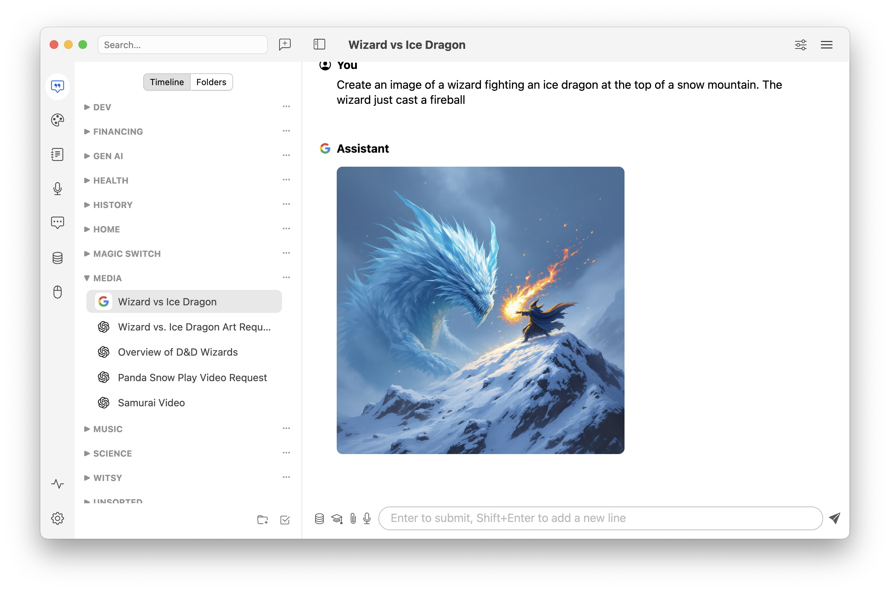
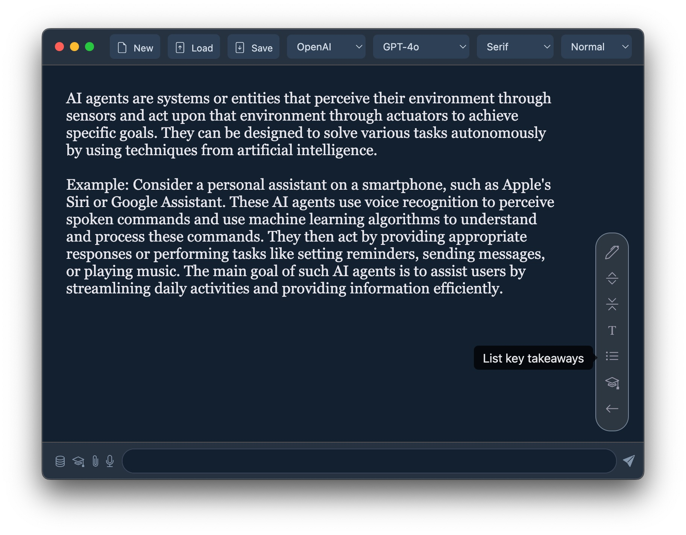
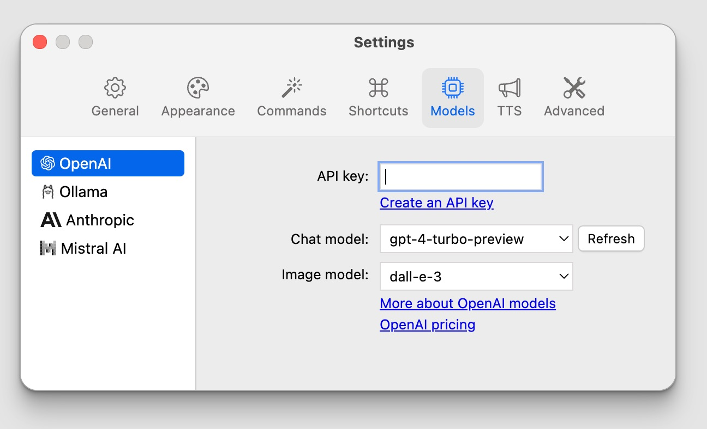

# Witty AI

Generative AI desktop application:
- Chat completion and image generation
- Vision model support
- OpenAI and Ollama models supported
- Local history conversation
- Code generation with easy copy
- Image download

<p></p>
 &nbsp;


## Setup

Until pre-packaged binaries are provided, you need to clone the repo and build yourself:
```
npm install
npm start
```

## Prerequisites

To use OpenAI models, you need to enter your [API key](https://platform.openai.com/api-keys).

To use Ollama models, you need to install [Ollama](https://ollama.com) and download [models](https://ollama.com/library).



## TODO

- [ ] Image placeholder
- [ ] Edit commands
- [ ] Customized commands
- [ ] Specialized assistants
- [ ] Customized assistants
- [ ] Rename conversation
- [ ] File upload for retrieval (??)
- [ ] Execute generated code (??)
- [ ] Proper database (SQLite3) storage (??)
- [ ] Nicer icon

- [x] AI Commands with shortcut
- [x] Auto-switch to vision model
- [x] Run at login
- [x] Shortcut editor
- [x] Chat font size settings
- [x] Image attachment for vision
- [x] Stop response streaming
- [x] Save/Restore window position
- [x] Ollama support
- [x] View image full screen
- [x] Status/Tray bar icon + global shortcut to invoke
- [x] Chat themes
- [x] Default instructions in settings
- [x] Save DALL-E images locally (and delete properly)
- [x] OpenAI links in settings
- [x] Copy code button
- [x] Chat list ordering
- [x] OpenAI model choice
- [x] CSS variables
