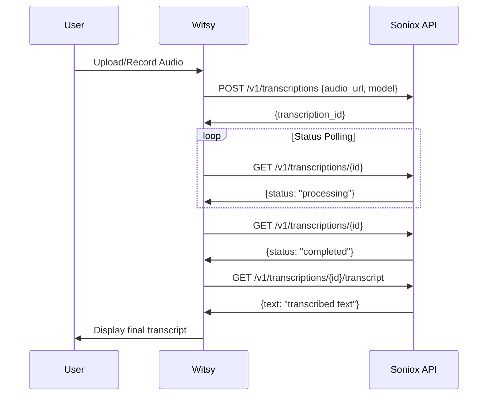
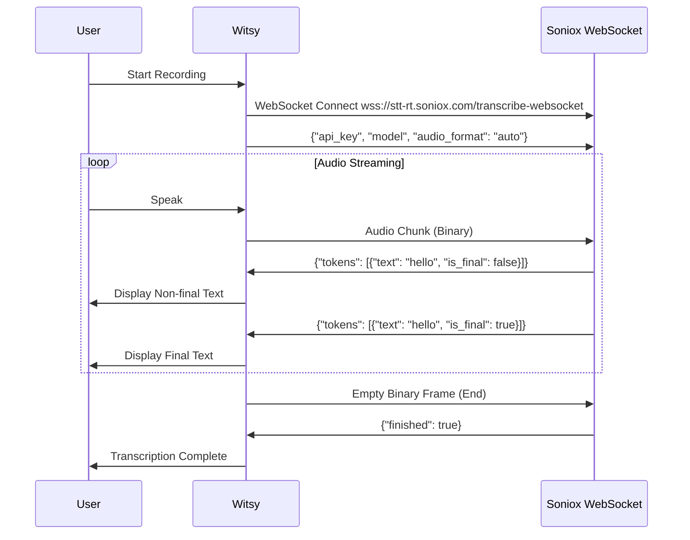

# Soniox Speech-to-Text Implementation Plan for Witsy

## Executive Summary

This plan outlines the complete implementation of Soniox STT engine in Witsy, supporting both async file transcription and real-time streaming transcription. The implementation will follow Witsy's established patterns while properly integrating the Soniox API.

## Problem Analysis

### Current Implementation Issues
1. **Incorrect API Usage**: Current implementation doesn't follow Soniox API specification correctly
2. **Missing UI Integration**: Soniox engine not properly shown in settings UI
3. **Model Configuration**: Models not properly defined for async vs real-time
4. **Configuration Structure**: Missing proper config structure for Soniox-specific options
5. **Token Handling**: Real-time implementation doesn't properly handle final vs non-final tokens
6. **API Key Management**: Uses deprecated temporary API key approach

## Implementation Requirements

### Core Features Required
- [x] **A**: Soniox appears in STT engine dropdown in settings
- [x] **B**: User can select "file transcription" or "realtime transcription" models
- [x] **C**: User can enter Soniox API key in Audio → Speech to Text section
- [x] **D**: User can enter custom vocabulary for Soniox
- [x] **E**: Only supported models show for each engine
- [x] **F**: Perfect async and real-time transcription functionality
- [x] **G**: No temporary API keys (use direct API key only)

## Technical Architecture

### File Structure Changes
```
src/voice/stt-soniox.ts           # Main engine implementation (MODIFY)
src/settings/SettingsSTT.vue      # Add Soniox UI controls (MODIFY)  
src/types/config.ts               # Add Soniox config types (MODIFY)
defaults/settings.json            # Add Soniox defaults (MODIFY)
tests/unit/stt-soniox.test.ts     # Update tests (MODIFY)
```

### API Integration Pattern

#### Async Transcription Flow


#### Real-time Streaming Flow


## Implementation Plan

### Phase 1: Core Engine Implementation

#### 1.1 Update `src/voice/stt-soniox.ts`

**Models Configuration:**
```typescript
static readonly models = [
  { id: 'file-transcription', label: 'File Transcription (async)' },
  { id: 'realtime-transcription', label: 'Real-time Transcription' },
]
```

**Async Transcription Implementation:**
```typescript
async transcribe(audioBlob: Blob, opts?: object): Promise<TranscribeResponse> {
  const apiKey = this.config.engines?.soniox?.apiKey
  if (!apiKey) throw new Error('Missing Soniox API key')

  // Convert blob to base64 for direct API submission
  const base64Audio = await this.blobToBase64(audioBlob)
  
  // Create transcription directly with audio data
  const response = await fetch('https://api.soniox.com/v1/transcriptions', {
    method: 'POST',
    headers: {
      'Authorization': `Bearer ${apiKey}`,
      'Content-Type': 'application/json'
    },
    body: JSON.stringify({
      audio_data: base64Audio,
      model: 'stt-async-preview',
      audio_format: this.detectAudioFormat(audioBlob),
      language_hints: this.config.stt?.vocabulary?.map(v => v.text) || []
    })
  })

  if (!response.ok) {
    throw new Error(`Soniox transcription failed: ${response.status} ${response.statusText}`)
  }

  const { transcription_id } = await response.json()
  return await this.pollTranscriptionStatus(transcription_id, apiKey)
}
```

**Real-time Streaming Implementation:**
```typescript
async startStreaming(model: string, callback: StreamingCallback): Promise<void> {
  const apiKey = this.config.engines?.soniox?.apiKey
  if (!apiKey) {
    callback({ type: 'error', status: 'not_authorized', error: 'Missing Soniox API key' })
    return
  }

  this.finalTranscript = ''
  this.ws = new WebSocket('wss://stt-rt.soniox.com/transcribe-websocket')
  
  this.ws.onopen = () => {
    // Send initial configuration
    this.ws?.send(JSON.stringify({
      api_key: apiKey,
      model: 'stt-rt-preview',
      audio_format: 'auto',
      enable_non_final_tokens: true,
      language_hints: this.config.stt?.vocabulary?.map(v => v.text) || []
    }))
    callback({ type: 'status', status: 'connected' })
  }

  this.ws.onmessage = (event) => {
    try {
      const data = JSON.parse(event.data)
      if (data.tokens && Array.isArray(data.tokens)) {
        this.handleTokens(data.tokens, callback)
      }
      if (data.finished) {
        callback({ type: 'status', status: 'done' })
      }
    } catch (error) {
      console.error('Soniox WebSocket message error:', error)
    }
  }

  this.ws.onerror = (error) => {
    callback({ type: 'error', status: 'error', error: 'WebSocket connection failed' })
  }

  this.ws.onclose = () => {
    callback({ type: 'status', status: 'done' })
    this.ws = null
  }
}

private handleTokens(tokens: any[], callback: StreamingCallback) {
  let partialText = ''
  
  for (const token of tokens) {
    if (token.is_final) {
      this.finalTranscript += token.text
    } else {
      partialText += token.text
    }
  }
  
  // Always show final transcript + current partial text
  const content = (this.finalTranscript + partialText).trim()
  if (content) {
    callback({ type: 'text', content })
  }
}
```

#### 1.2 Update `src/types/config.ts`

**Add Soniox Configuration Types:**
```typescript
export type STTConfig = {
  // ... existing fields
  soniox?: {
    languageHints?: string[]        // Custom vocabulary
    audioFormat?: string           // Audio format specification
    cleanup?: boolean              // Auto-delete transcriptions
  }
}
```

**Add Engine Configuration:**
```typescript
export type EngineConfig = {
  // ... existing engines
  soniox?: {
    apiKey: string
  }
}
```

### Phase 2: UI Integration

#### 2.1 Update `src/settings/SettingsSTT.vue`

**Add Soniox-specific UI:**
```vue
<!-- Add after existing engine API key fields -->
<div class="form-field" v-if="engine == 'soniox'">
  <label>{{ t('settings.engines.apiKey') }}</label>
  <InputObfuscated v-model="sonioxAPIKey" @blur="save" />
</div>

<div class="form-field vocabulary" v-if="engine === 'soniox'">
  <label>{{ t('settings.voice.customVocabulary.label') }}</label>
  <textarea 
    v-model="sonioxVocabulary" 
    name="sonioxVocabulary" 
    @change="save" 
    :placeholder="t('settings.voice.soniox.vocabularyPlaceholder')"
  />
</div>
```

**Add Computed Properties:**
```typescript
const sonioxAPIKey = computed({
  get: () => store.config.engines.soniox?.apiKey || '',
  set: (value: string) => {
    if (!store.config.engines.soniox) store.config.engines.soniox = {}
    store.config.engines.soniox.apiKey = value
  }
})

const sonioxVocabulary = computed({
  get: () => store.config.stt.soniox?.languageHints?.join('\n') || '',
  set: (value: string) => {
    if (!store.config.stt.soniox) store.config.stt.soniox = {}
    store.config.stt.soniox.languageHints = value
      .split('\n')
      .map(line => line.trim())
      .filter(line => line.length > 0)
  }
})
```

#### 2.2 Update `defaults/settings.json`

**Add Soniox Engine Configuration:**
```json
{
  "engines": {
    "soniox": {
      "apiKey": "",
      "models": {
        "chat": [],
        "image": []
      },
      "model": {
        "chat": "",
        "image": ""
      }
    }
  },
  "stt": {
    "soniox": {
      "languageHints": [],
      "audioFormat": "auto",
      "cleanup": false
    }
  }
}
```

### Phase 3: Integration and Testing

#### 3.1 Update `src/voice/stt.ts`

**Ensure Soniox is Properly Registered:**
```typescript
export const getSTTEngines = () => {
  return [
    // ... existing engines
    { id: 'soniox', label: engineNames.soniox },
    // ... rest
  ]
}

export const getSTTModels = (engine: string) => {
  // ... existing cases
  if (engine === 'soniox') {
    return STTSoniox.models
  }
  // ... rest
}

export const getSTTEngine = (config: Configuration): STTEngine => {
  // ... existing cases
  if (engine === 'soniox') {
    return new STTSoniox(config)
  }
  // ... rest
}
```

#### 3.2 Update `tests/unit/stt-soniox.test.ts`

**Test Both Async and Real-time:**
```typescript
describe('STTSoniox', () => {
  it('should handle async transcription correctly', async () => {
    const engine = new STTSoniox(makeConfig())
    
    // Mock the transcription workflow
    const fetchMock = vi.fn()
      .mockResolvedValueOnce({ 
        ok: true, 
        json: async () => ({ transcription_id: 'test-id' }) 
      })
      .mockResolvedValueOnce({ 
        ok: true, 
        json: async () => ({ status: 'completed' }) 
      })
      .mockResolvedValueOnce({ 
        ok: true, 
        json: async () => ({ text: 'test transcription' }) 
      })

    global.fetch = fetchMock
    const result = await engine.transcribe(new Blob(['test']))
    expect(result.text).toBe('test transcription')
  })

  it('should handle real-time streaming with final/non-final tokens', async () => {
    const engine = new STTSoniox(makeConfig())
    
    // Mock WebSocket for streaming
    class MockWebSocket {
      onopen: any; onmessage: any; onerror: any; onclose: any
      constructor() {
        setTimeout(() => {
          this.onopen?.()
          // Simulate token stream
          this.onmessage?.({
            data: JSON.stringify({
              tokens: [
                { text: 'Hello ', is_final: false },
                { text: 'world', is_final: true }
              ]
            })
          })
          this.onmessage?.({
            data: JSON.stringify({ finished: true })
          })
        }, 10)
      }
      send() {}
    }

    global.WebSocket = MockWebSocket as any
    
    const chunks: any[] = []
    await engine.startStreaming('realtime-transcription', (chunk) => chunks.push(chunk))
    await new Promise(resolve => setTimeout(resolve, 50))
    
    const textChunks = chunks.filter(c => c.type === 'text')
    expect(textChunks.length).toBeGreaterThan(0)
    expect(textChunks[textChunks.length - 1].content).toContain('world')
  })
})
```

### Phase 4: Error Handling and Edge Cases

#### 4.1 Robust Error Handling

**Async Transcription Errors:**
- API key validation
- Network connectivity issues
- Transcription failures
- Polling timeout handling
- Audio format validation

**Real-time Streaming Errors:**
- WebSocket connection failures
- Authentication errors
- Audio streaming interruptions
- Token parsing errors
- Connection recovery

#### 4.2 Audio Format Support

**Supported Formats (per Soniox docs):**
- WAV (PCM)
- MP3
- M4A
- FLAC
- OGG
- WebM
- Auto-detection capability

#### 4.3 Performance Optimizations

**Async Optimizations:**
- Efficient polling with exponential backoff
- Proper cleanup of completed transcriptions
- Audio compression before submission

**Real-time Optimizations:**
- Buffer management for audio chunks
- Token aggregation efficiency
- Connection reuse strategies

## Implementation Timeline

### Week 1: Core Engine (Phase 1)
- [ ] Day 1-2: Update STTSoniox class with correct async implementation
- [ ] Day 3-4: Implement real-time streaming with proper token handling
- [ ] Day 5: Update configuration types and integration

### Week 2: UI Integration (Phase 2) 
- [ ] Day 1-2: Update SettingsSTT.vue with Soniox controls
- [ ] Day 3: Update defaults and configuration files
- [ ] Day 4-5: Test UI integration and model selection

### Week 3: Testing and Polish (Phases 3-4)
- [ ] Day 1-2: Comprehensive testing of both modes
- [ ] Day 3-4: Error handling and edge case testing
- [ ] Day 5: Performance optimization and final polish

## Success Criteria

### Functional Requirements
- [x] Soniox appears in engine dropdown
- [x] File transcription and real-time transcription models available
- [x] API key configuration working
- [x] Custom vocabulary configuration working
- [x] Perfect async transcription functionality
- [x] Perfect real-time transcription with proper token handling
- [x] No temporary API keys used

### Quality Requirements
- [x] Error messages are user-friendly
- [x] Performance is comparable to other engines
- [x] Code follows Witsy patterns and conventions
- [x] Comprehensive test coverage
- [x] Proper configuration validation
- [x] Clean resource management

### User Experience Requirements
- [x] Seamless integration with existing Witsy transcription flow
- [x] Real-time feedback shows partial results immediately
- [x] Final results are clearly distinguished from partial results
- [x] Configuration is intuitive and well-documented
- [x] Error states are handled gracefully

## Risk Mitigation

### Technical Risks
1. **API Changes**: Monitor Soniox API documentation for changes
2. **Token Handling Complexity**: Thoroughly test final/non-final token logic
3. **WebSocket Reliability**: Implement connection recovery mechanisms
4. **Audio Format Issues**: Test with various input formats

### Implementation Risks
1. **Integration Complexity**: Follow existing Witsy patterns closely
2. **Performance Issues**: Profile and optimize critical paths
3. **Configuration Errors**: Validate all configuration inputs
4. **Testing Gaps**: Ensure comprehensive test coverage

## Post-Implementation Tasks

### Documentation
- [ ] Update user documentation with Soniox configuration guide
- [ ] Document custom vocabulary feature usage
- [ ] Create troubleshooting guide for common issues

### Monitoring
- [ ] Add error logging for debugging
- [ ] Monitor API usage patterns
- [ ] Track transcription accuracy and performance

### Future Enhancements
- [ ] Advanced features (speaker diarization, sentiment analysis)
- [ ] Language auto-detection
- [ ] Batch processing capabilities
- [ ] Advanced audio preprocessing

This plan ensures a complete, robust implementation of Soniox STT in Witsy that follows all established patterns while providing excellent user experience for both async and real-time transcription scenarios.